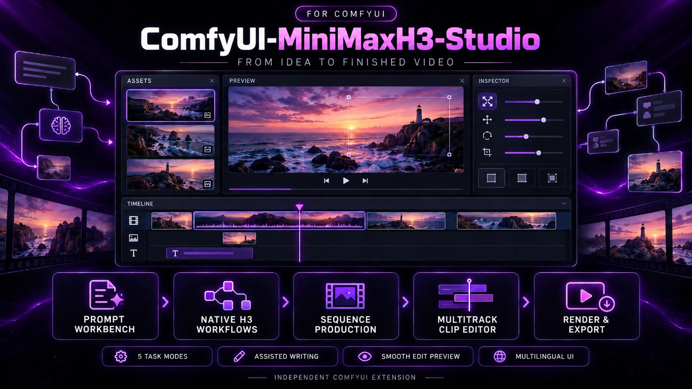
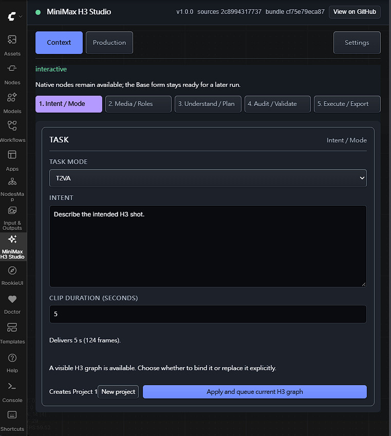
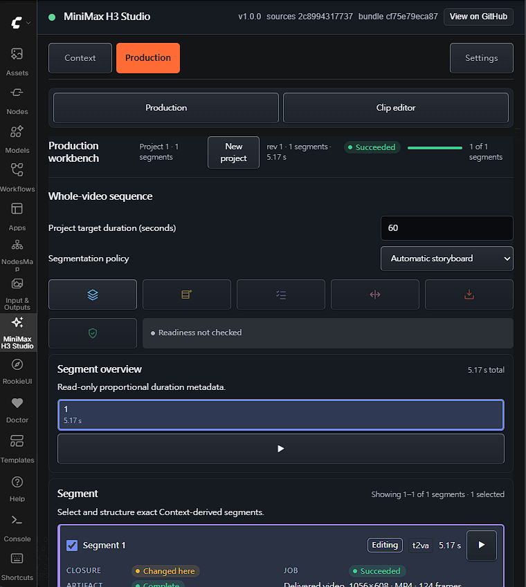
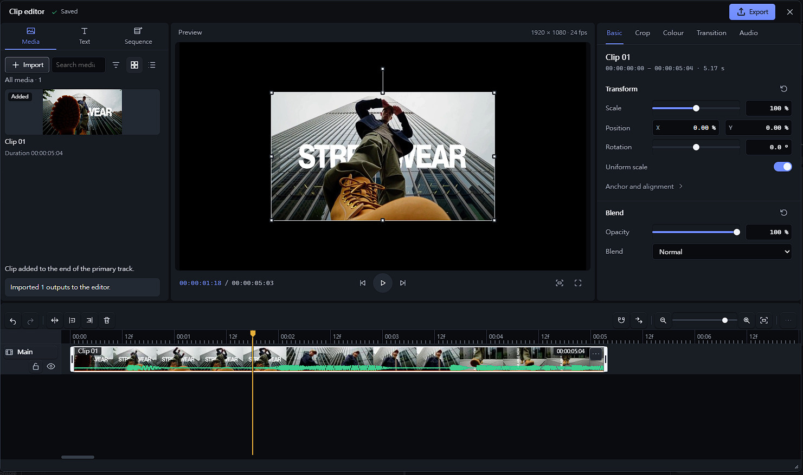

# ComfyUI-MiniMaxH3-Studio

https://github.com/user-attachments/assets/ac7c74e5-69b0-459f-b4e2-925e4c182308

Turn a description into a MiniMax H3 video without leaving ComfyUI. Build a prompt you can
inspect, generate clips with the official H3 workflows, plan a longer video, then cut and render
the result in a built-in editor.

Everything lives in one ComfyUI sidebar, backed by 28 canvas nodes that share the same prompt
pipeline. This is an independent custom-node project, not MiniMax's official Context-IR
implementation.

<p align="center">
  
</p>

<details><summary><h2>Latest Updates - Click to expand</h2></summary>

<details>

<summary><strong>1.1.0 — Project files, recovery and editor improvements</strong></summary>

- Save and open editable `.h3proj` projects, with explicit relinking when media is missing.
- Optionally retain verified generated videos and recover acknowledged drafts with data-only
  undo/redo after a restart. Each storage option is off by default.
- Adjust clip volume, mute and fades in the Inspector, preview and final render; enjoy steadier
  playback across edits and cuts, reliable timeline shortcuts and clearer title-insertion feedback.
- Generated-video closure now accepts Linux host paths. Editor media and durable recovery still
  require their supported Windows setup.
- Source and Registry distributions include complete public developer inputs and exclude private
  records, dependency installations and caches.

</details>

<details>

<summary><strong>1.0.2 — Assisted prompt writing and model setup</strong></summary>

- Set up Ollama or a remote provider, reload available models and choose an exact model; readiness
  is checked automatically, and reloading keeps the selection when the model is still available.
- Browse provider-reported model dates, limits and lifecycle labels, with a local filter for large
  model lists and requests adapted to each provider's API.
- Use **Refine prompt** to direct a revision while preserving exact dialogue, visible text,
  reference roles and timing. Every suggestion remains yours to review before applying.
- Read and compare prompts without losing local edits, focus, text selection or scroll position.
- Review typed semantic suggestions with a bounded repair attempt for invalid responses. The
  canvas **H3 Semantic Proposal Producer** can use an exact installed Ollama model while keeping
  historical workflows compatible.

</details>

</details>

## Contents

- [Features](#features)
- [Before you start](#before-you-start)
  - [Requirements](#requirements)
  - [Compatibility](#compatibility)
- [Install and update](#install-and-update)
  - [Install](#install)
  - [Update an existing installation](#update-an-existing-installation)
  - [Media tools](#media-tools)
- [Quick start](#quick-start)
- [The sidebar at a glance](#the-sidebar-at-a-glance)
- [Create a clip](#create-a-clip)
  - [Task modes and references](#task-modes-and-references)
  - [Dialogue and exact text](#dialogue-and-exact-text)
  - [Duration](#duration)
  - [Review the prompt](#review-the-prompt)
  - [Start H3 App Mode](#start-h3-app-mode)
  - [During and after a run](#during-and-after-a-run)
- [Production](#production)
  - [Project and segments](#project-and-segments)
  - [Arrange and generate segments](#arrange-and-generate-segments)
  - [Previews and intent proposals](#previews-and-intent-proposals)
- [Clip editor](#clip-editor)
  - [Open the editor](#open-the-editor)
  - [Layout](#layout)
  - [Media bin](#media-bin)
  - [Timeline](#timeline)
  - [Keyboard shortcuts](#keyboard-shortcuts)
  - [Inspector](#inspector)
  - [Preview monitor](#preview-monitor)
  - [Render the final video](#render-the-final-video)
  - [Keeping your work](#keeping-your-work)
- [Longer videos](#longer-videos)
  - [Plan in Production](#plan-in-production)
  - [Write a storyboard script](#write-a-storyboard-script)
  - [Generate and assemble in the editor](#generate-and-assemble-in-the-editor)
- [Canvas nodes](#canvas-nodes)
- [Assisted authoring (optional)](#assisted-authoring-optional)
- [Privacy and storage](#privacy-and-storage)
- [Known limitations](#known-limitations)
- [Troubleshooting](#troubleshooting)
- [More documentation](#more-documentation)
- [License](#license)

## Features

- **Inspectable prompts.** Turn your intent, references, duration and exact dialogue or on-screen
  text into a structured plan, a prompt and a validation report. Missing information stays
  visible instead of being guessed.
- **Five task modes.** Text to video, opening image, first and last frames, ending image, or a
  reference set of image, video and audio with explicit roles.
- **One-click official workflows.** App Mode writes the official MiniMax H3 workflow for your mode
  into the active workflow tab using the H3 weights you have installed, or connects your prompt to
  an H3 graph you already have. Use a separate empty tab to try the official template while keeping
  your current workflow.
- **Production workbench.** Collect generated clips as segments of a project; reorder, replace or
  regenerate them, preview them and pick which ones to edit.
- **Longer videos.** Plan a 4 to 60 second video as a storyboard, generate its segments one after
  another and join them.
- **Built-in editor.** Arrange clips on up to eight tracks, trim and split, add text, picture and
  video overlays, adjust position, crop, colour, transitions and each clip's volume and fades, then
  render and download an MP4.
- **Optional assisted authoring.** Ask Ollama or Gemini to suggest prompt improvements; you accept
  or reject every suggestion. OpenAI and Anthropic connections support model discovery and
  readiness checks.
- **Project files and optional recovery.** Save accepted editable work to `.h3proj` files. On a
  qualified local host, separately opt in to metadata, verified-video retention or draft recovery.
  Exported projects do not embed media or execution permissions.
- **Three languages.** English, Traditional Chinese and Simplified Chinese.

Public source and Registry packages include the test suites and their support files. See
[development and testing](docs/DEVELOPMENT.md) for environment setup and validation commands.

## Before you start

### Requirements

- **ComfyUI** with its native MiniMax H3 nodes (`MiniMaxH3ImageToVideo`,
  `MiniMaxH3ReferenceToVideo`), the official `video_minimax_h3_*` workflow templates and a frontend
  that supports sidebar extensions. Python 3.10 or newer.
- **MiniMax H3 model weights** and suitable hardware to generate video. Building and checking
  prompts needs no weights.
- **Windows x64 with 64-bit Python** for the clip editor, Production import, longer-video assembly
  and final rendering, plus the [media tools](#media-tools), which are found or installed for you.

The package has no required Python dependencies and never installs or changes ComfyUI, its
frontend or your models.

### Compatibility

The sidebar checks what your host actually provides (the native H3 nodes, their inputs, the
templates and the frontend functions it uses), not a version number. If something is missing, the
message names it. The canvas nodes keep working even when the sidebar cannot load.

- The prompt pipeline runs on Windows, Linux and WSL. The media features need Windows x64.
- The clip editor has been tested on ComfyUI 0.38.0 with frontend 1.53.6. This is a tested
  combination, not a minimum version.
- Longer-video generation checks the installed H3 implementation separately. If it reports an
  incompatibility, use a complete, compatible ComfyUI installation; installing FFmpeg or waiting
  does not fix it.

If you open ComfyUI through a reverse proxy, a port mapping or a host name other than `localhost`,
see [opening ComfyUI from another address](docs/SECURITY_AND_PROVIDERS.md#opening-comfyui-from-another-address).

## Install and update

### Install

To install manually:

1. Save any open ComfyUI workflows and download the videos you want to keep, then stop ComfyUI.
2. Clone or copy the complete repository into `ComfyUI/custom_nodes/ComfyUI-MiniMaxH3-Studio`:

   ```bash
   cd ComfyUI/custom_nodes
   git clone https://github.com/rookiestar28/ComfyUI-MiniMaxH3-Studio.git
   ```

   Keep both the root `__init__.py` and the `comfyui_h3_context/` folder.
3. Start ComfyUI and check that the H3 Context nodes and the **MiniMax H3 Studio** sidebar appear.

Installation does not download models, contact a provider or run a frontend build; the browser
extension comes prebuilt.

If the package is available through your Comfy Registry or ComfyUI Manager, search for
**ComfyUI-MiniMaxH3-Studio**, or run:

```text
comfy node install minimax-h3-studio
```

### Update an existing installation

1. Save your workflows and download the videos you want to keep.
2. Replace the whole package with the new version. Do not mix files from two versions, and do not
   keep a second copy of this pack beside the first.
3. Restart ComfyUI and refresh the browser. If the old interface still shows, hard-refresh after
   checking that the host loaded the intended version. The sidebar header shows the loaded version.

Keep the previous version for rollback. Save accepted Production/editor work as a `.h3proj` file
and preserve its media separately before updating. A workflow save or downloaded video does not
back up the editable project. Optional recovery covers only acknowledged server saves, not edits
still waiting in the browser.

### Media tools

The clip editor, Production import, longer-video assembly and final rendering use one exact FFmpeg
build on Windows x64 with 64-bit Python: the gyan.dev full build `2026-02-26-git-6695528af6`. No
path setup is needed.

- **Already installed.** If that build's `ffmpeg.exe` and `ffprobe.exe` are in your Python
  environment or on `PATH`, they are found the first time you use a media feature.
- **Not installed.** When a feature needs the tools, a **Media tools** card appears with **Install
  and continue**. It downloads the build from its GitHub release (about 235 MB), checks it, keeps
  only the two programs with their license and readme, then carries on with what you started.
  **Cancel setup** stops the download without changing your work. The same **Install** button is
  in **Settings → Media tools**.
- **Where it goes.** The installed copy (about 425 MB) lives in ComfyUI's private user data,
  outside this package, and is reused after restarts.
- **Offline or managed computers.** In **Settings → Media tools → Advanced**, enter a folder that
  holds both programs of that build and choose **Use this folder**. **Use automatic setup** returns
  to the default. The download never uses a proxy, so use this option on computers that need one.
- **Administrators** can set `H3_CONTEXT_AUTHORIZED_FFMPEG_PATH` and
  `H3_CONTEXT_AUTHORIZED_FFPROBE_PATH` to the two programs in one folder; this overrides everything
  else. `H3_CONTEXT_AUTHORIZED_MEDIA_SCRATCH_ROOT` can name the temporary media folder.

Any other FFmpeg build, a modified file, Windows on ARM, 32-bit Python or a non-Windows host is not
used, and the card says why. To check a copy yourself, compare these SHA-256 fingerprints:

- `ffmpeg.exe`: `abf5e1652dfdd3f8d7cfbb4900a4b590b7e8d192876164b7b7e9efaebe26d67f` <!-- pragma: allowlist secret -->
- `ffprobe.exe`: `fb81e32ea05d77049291d9cffb0ec2677cfbe5e1ce2021bbcb9eb5abdc6ac576` <!-- pragma: allowlist secret -->

FFmpeg is licensed separately under GPL-3.0-or-later and is not shipped with this package.

## Quick start

1. Save your current ComfyUI workflow. To try the official H3 template separately, open a new empty
   workflow tab and make it active.
2. Open **MiniMax H3 Studio** in the ComfyUI sidebar.
3. On the **Context** page, choose a task mode, describe the video and set a duration of 4 to 15
   seconds.
4. Select the images, video or audio that mode needs.
5. Press **Start H3 App Mode**. The official workflow appears in the active tab; check its settings
   and queue it.
6. When the video is ready it appears on the **Production** page. Each new run from the same
   workflow adds a segment to the same project.

To use your own H3 workflow, keep its tab active and follow
[Connect and queue current canvas](#start-h3-app-mode). If you want to leave the current canvas
untouched, choose **Keep canvas and exit H3 App Mode** when offered.

## The sidebar at a glance

Open **MiniMax H3 Studio** from the ComfyUI sidebar. It has three pages:

| Page       | What it is for                                                                                |
| ---------- | --------------------------------------------------------------------------------------------- |
| Context    | Choose a task mode, describe the video, pick references, review the prompt and start App Mode |
| Production | Your generated clips as a project, longer-video planning, and the entry to the clip editor    |
| Settings   | Language, the media tools and the optional assisted-authoring provider                        |

**Settings → Language** offers **Automatic (ComfyUI locale)**, English, 繁體中文 and 简体中文.

The prompt is built on the ComfyUI host by the same nodes you can use on the canvas, so the sidebar
and the canvas never disagree.

## Create a clip

<p align="center">
  
</p>

The **Context** page walks through five stages, shown as numbered tabs: **Intent / Mode**,
**Media / Roles**, **Understand / Plan**, **Audit / Validate** and **Execute / Export**. You can
also simply fill in the request and choose **Start H3 App Mode**.

### Task modes and references

| Task mode | You provide                                                           |
| --------- | --------------------------------------------------------------------- |
| T2VA      | Text to video: a description only                                     |
| I2VA      | Image to video: a **First frame source**                              |
| FL2VA     | First and last frame: two different images                            |
| L2VA      | Last frame: a **Last frame source**                                   |
| Ref2VA    | Reference set: an image, a video and/or audio, each with a clear role |

References are image, video and audio nodes already on your canvas. For a reference set, choose
at most one of each kind under **Reference images**, **Reference videos** and **Reference audio**.
Audio cannot be the only reference; add an image or a video with it. When you choose a reference
video, **Reference video soundtrack** lets you **Submit the video's own soundtrack** (the default)
or **Do not submit a soundtrack**.

Roles and order are never guessed: a missing or conflicting role is reported so you can fix it.

### Dialogue and exact text

Enter dialogue, lyrics, on-screen text and anything that must or must not appear as **hard
constraints** when the exact wording matters. They are kept word for word.

For dialogue you can also set:

- the **language**: `auto` or one of Arabic, Chinese, English, French, German, Italian, Japanese,
  Korean, Portuguese, Russian and Spanish. `auto` recognizes Korean, Japanese and Chinese from
  their scripts; other scripts stay untagged with a warning. The spoken words never change;
- the **speaker**, as a short identity phrase such as `the guide`;
- the **delivery**: spoken on screen, or an off-screen voiceover (the speaker's lips stay closed).

### Duration

Enter **Clip duration (seconds)** as a whole number from 4 to 15 (default 5). The extension converts
it to a length H3 can produce and shows the delivered seconds and frame count.
**Start H3 App Mode** stays disabled until that is resolved; if it fails, choose **Retry duration
resolution**. The workflow uses this one duration everywhere, so there are never two conflicting
length settings.

### Review the prompt

Before generating, the Context page shows the prompt, the plan behind it and a validation report.
Fix errors before queueing; warnings point out uncertainties you may accept. You can also:

- type `@` in the prompt to insert a reference;
- edit the prompt and choose **Validate revision** to check your edit;
- **Copy prompt**, **Export JSON** or **Import JSON**;
- choose **Optimize prompt** when [assisted authoring](#assisted-authoring-optional) is set up, then
  edit, accept or reject the proposal;
- open **Revision instruction** to give a wording or style direction and choose **Refine prompt**;
- use **Reader** for the complete prompt, or **Compare with current report** for an active AI proposal.

**Guide readiness** is a separate check against the official H3 prompt guide: **Ready** means every
known requirement is covered, **Incomplete** means something the guide expects is missing, even if
the prompt is valid. Neither judges visual quality.

### Start H3 App Mode

**Start H3 App Mode** writes the official ComfyUI MiniMax H3 workflow for your task mode onto the
active workflow tab, without queueing it. Save any unsaved workflow before starting. To try the
official template separately, open a new empty workflow tab and make it active first. To connect
your own H3 workflow instead, keep its tab active and use the Connect option below.

App Mode uses these official templates:

| Task mode         | Official template                 |
| ----------------- | --------------------------------- |
| T2VA              | `video_minimax_h3_t2v`            |
| I2VA, FL2VA, L2VA | the `video_minimax_h3_i2v` family |
| Ref2VA            | `video_minimax_h3_r2v`            |

Model loaders are filled from your installed official H3 weights. If a model cannot be matched, it
is named as a warning and left for you to pick on the canvas; ComfyUI checks the models when the
workflow is queued. The workflow is a normal ComfyUI graph that you can inspect and change. Queue it
with **Apply and queue current H3 graph** or ComfyUI's own Queue button.

If the canvas already has nodes, App Mode asks first:

- **Replace canvas and start H3 App Mode** replaces the graph in the active tab with the official
  workflow. Save the current workflow before choosing it;
- **Connect and queue current canvas** keeps your graph, connects the prompt to the H3 generation
  node you choose and queues it once. Your models, LoRAs, sampler and other settings stay as they
  are;
- **Keep canvas and exit H3 App Mode** leaves the current canvas untouched and exits App Mode,
  without queueing a run.

Connect adds the prompt connection and queues a run; Keep makes no canvas changes. Neither choice
saves a backup of your workflow. Use ComfyUI's own workflow Save action to preserve unsaved canvas
work. Saving a ComfyUI workflow does not back up the separate Production or editor project.

Connect works with your own H3 workflows, not only the official ones. It looks for the native H3
generation nodes on the canvas and one subgraph level inside it; when there are several, choose
one under **H3 generation node to connect**. The task mode must match how that node is wired: a
connected first frame means I2VA, a last frame L2VA, both FL2VA, and neither T2VA. Connect is not
offered when the canvas already contains H3 Context nodes; use **Apply and queue current H3 graph**
instead.

If an existing canvas is replaced without a choice being shown, report the loaded sidebar version
and the actions you took. Include **Copy diagnostics** when available so the unexpected change
can be investigated.

**Cancel App Mode** stops while App Mode is working, and **Continue with native nodes** leaves App
Mode so you can work on the canvas yourself.

### During and after a run

A run is queued once through the normal ComfyUI queue. It is reported as finished only after the
saved video has been checked against that run; a video that cannot be matched is reported as
unconfirmed and never retried automatically. If the connection to ComfyUI drops, the sidebar picks
the run up again when it reconnects.

The finished video is added to the **Production** project shown above the App Mode buttons ("Adds
to Project …" or "Creates Project …"):

- every new run from the same workflow adds one segment to the same project;
- choose **New project** before starting when the next result should go elsewhere;
- **Edit App Mode setup** returns to the request for the next run.

If App Mode declines a run, it shows the reason and a remedy, with **Retry H3 App Mode** or **Retry
output verification** where they apply. **Copy diagnostics** copies a short report for support; it
never contains your prompt, workflow, file paths or credentials.

## Production

<p align="center">
  
</p>

The **Production** page has two views, switched at the top: **Production** for your project and
**Clip editor** for [the editor](#clip-editor).

### Project and segments

- The status band names the project and its segment count, with **New project** and a progress
  meter while segments generate.
- **Segment overview** shows each segment's share of the video. Its seconds are marked "snapped"
  when H3 delivers a slightly different length from the one requested.
- The **segment list** shows 32 segments per page. Tick segments to select them; with exactly one
  selected, its row expands to show its state, output, continuity and boundary.
- **Project target duration (seconds)**, from 4 to 60, is the intended length of the whole video.
  It is used by [longer-video planning](#longer-videos), is separate from the next App Mode clip's
  4–15 seconds, and never starts a generation when changed.

### Arrange and generate segments

- **Reorder** by dragging a tile in the segment overview, with the arrows on a selected segment, or
  by typing its **Position** and choosing **Apply**.
- **Add current Context** adds a segment from the current Context request. With one segment
  selected, **Replace segment N with current Context** or **Delete segment N** (the last segment
  cannot be deleted).
- **Relationship for segment N** sets how a segment joins the previous one: **Independent**,
  **Predecessor**, **Adjacent pair**, **Cut** or **Reset**; the second and third need an earlier
  segment. Choose **Apply relationship to segment N** to keep it. Changing a segment only reruns
  what depends on it.
- **Generate segment N** queues one segment when it is ready; **Blockers** says why it is not.
- **Release workspace** closes this Production workspace after **Confirm release**. The Context and
  earlier outputs stay unchanged.

### Previews and intent proposals

- **Preview segment N** (the play button on a tile) and **Preview aggregate output** play a copy
  on the host. The aggregate preview marks where each segment begins, and its sample thumbnails
  jump to that point. A missing button means that output cannot be previewed yet.
- **Understand segment N** and **Understand selected** open a proposal review when the segment kept
  an intent proposal from its original Context run. A segment without one is still valid.

To edit outputs, open the clip editor and use its **Import** button (see [Media bin](#media-bin)).

## Clip editor

<p align="center">
  
</p>

In short: in **Production**, tick up to three finished segments, switch to **Clip editor** and
choose **Open full editor**. Bring the segments in with **Import** in the media bin, place them on
the timeline, trim and arrange them, add titles and overlays, then choose **Export → Render final
video**. The result is a 1920 × 1080, 24 fps MP4 that you download with **Download original**.

### Open the editor

Switch the Production page to **Clip editor** and choose **Open full editor**. If there is no editor
project yet, choose **Start authoring from this context** first. The editor opens as one window over
ComfyUI; all editing, selection, undo and redo happen there. Close it with its close button or
**Escape**.

The Clip editor view in the sidebar summarizes the editor project and offers **Refresh workspace**
and **Release workspace** (not while the editor is open).

### Layout

The window has a top bar and four regions: the **Media bin** on the left, the **Preview monitor**
in the middle, the **Inspector** on the right and the **Timeline** across the bottom. The media bin
has three tabs: **Media**, **Text** and **Sequence** (for [longer videos](#longer-videos)).

- Drag the dividers between regions to resize them, or focus one and use the arrow keys (**Shift**
  for bigger steps). **Enter** or a double-click resets a divider.
- Drag the window's corner grip to resize the window, down to 720 × 480 pixels. In a small window
  the regions scroll.
- The top bar shows the edit status: **Saving…**, **Saved**, **Edit refused**, **Save status
  unknown** and similar. **Saved** means ComfyUI accepted the edit; it is not a project file. If the
  status is unknown, let the editor re-read the host and follow its message before editing again.
- Use **Project file** in Production, the Editor summary or the editor's Project menu to save or
  open an editable `.h3proj` document. See [Project files](docs/PROJECT_FILES.md) for media relinking
  and the difference between a written file and a prepared download.

### Media bin

The **Media** tab holds the clips available to this editor project.

- **Import** brings in the outputs selected in Production: up to three finished segments. If the
  selection also contains unfinished segments, the button reads **Import ready (2 of 3)** and imports
  only the finished ones. Importing adds sources to the bin; it does not place them on the
  timeline or start a generation.
- **Search media**, **Sort and filter** (source or reverse order; all media, videos, pictures, or
  those already added to the timeline) and **Grid view** / **List view** help in a full bin.
- Click a card, or its **+**, to add it: a video goes to the end of the **Main** track, a picture
  goes to a picture overlay track at the playhead.
- Right-click a card, or use its **More clip actions** button, for **Add to timeline**, **Insert at
  playhead** and **Overwrite at playhead**.

The **Text** tab adds titles: enter **Title text**, pick a **Font** and choose **Add title**. The
title is placed at the playhead on the first unlocked text track that is free there; if there is no
such track, the editor creates one within the eight-track limit. A new title lasts one second;
trim it like any clip to change its length. One **Undo** removes both the new track and its
title. You can add the first title to an empty project. If insertion is unavailable, the disabled
button's explanation says what to change, such as freeing a track or choosing a font.

### Timeline

The timeline has the **Main** video track plus video, picture and text overlay tracks: up to eight
tracks, 128 clips and 2.5 minutes in total.

- **Track headers** show or hide a track (eye button) and lock or unlock it. The track name opens
  its menu, where you can **Add track**, **Reorder track** or **Remove track**; **Main** cannot be
  removed.
- **Selecting**: click a clip; **Shift**-click to extend the selection, **Ctrl**-click to add or
  remove one, or drag across an empty lane to box-select.
- **Moving**: drag a clip to another time or a compatible track (hold **Alt** to suspend snapping).
  With a clip focused, **Enter** starts a keyboard move: arrow keys move it, **Alt+Up/Down** changes
  track, **Enter** applies and **Escape** cancels.
- **Trimming**: drag a selected clip's edge, or focus the edge and use the arrow keys, **Enter** and
  **Escape**. Turn on **Main-track ripple** to make trims and deletes shift the clips that follow on
  the same track.
- **Roll edits** move a shared cut between two neighbouring clips with the handle on the cut.
- **Clip menu** (right-click a clip): one-frame trims, **Replace clip asset**, **Slip clip**,
  **Slide clip**, **Merge clips** with the next one, and **Clip enabled**. Menus close when you
  press elsewhere.
- **Toolbar**: **Undo**, **Redo**, **Split at playhead**, **Trim start to playhead**, **Trim end to
  playhead**, **Delete** (or **Ripple delete**), **Snapping**, **Main-track ripple**, zoom and
  **Fit timeline**. **More timeline tools** adds roll edits, numeric moves, selection, clip
  navigation and panning.
- **Ruler**: click or drag to move the playhead. **Ctrl** + mouse wheel zooms; **Shift** + wheel
  pans.

Each completed edit is one undo step. An edit can be refused, for example by a locked track or the
source's length; read the reason before trying again. Refused edits are never replayed
automatically. If the timeline changed under you, a banner offers **Rebase rejected edit**.

The workspace summary shows **Content extent** (up to the end of the last placed clip, including a
disabled one) and **Edit capacity** (the space available). The final video covers the content
extent, gaps included. An empty timeline cannot be rendered.

### Keyboard shortcuts

| Action                       | Keys                  |
| ---------------------------- | --------------------- |
| Undo / Redo                  | Ctrl+Z / Ctrl+Shift+Z |
| Split at playhead            | Ctrl+B                |
| Trim start / end to playhead | Q / W                 |
| Delete / Ripple delete       | Delete / Shift+Delete |
| Select all clips             | Ctrl+A                |
| Zoom in / out                | Ctrl+= / Ctrl+-       |
| Fit timeline                 | Shift+Z               |
| Play or pause                | Space                 |
| Step one frame               | , and .               |

Edit and view shortcuts also work after clicking a clip, a timeline tool, a trim grip or a roll
handle. Space and Enter keep the focused button's own action. A keyboard move, trim or roll draft
keeps its keys until you commit or cancel it. Fields, value controls, menus and buttons outside the
timeline keep their own keys, so typing in the Inspector never edits the timeline.

Keys used inside the editor stay within its window, including undo and redo. If the host cannot
keep the editor's keys separate from ComfyUI's own shortcuts, the full editor reports that it is
unavailable.

### Inspector

Select a clip to edit its properties. The tabs depend on the clip:

| Tab        | What it changes                                                                 |
| ---------- | ------------------------------------------------------------------------------- |
| Basic      | Scale, position, rotation, anchor and alignment; opacity and blend mode         |
| Crop       | The four edges                                                                  |
| Colour     | Brightness, contrast and saturation (choose **Color adjustment** as the effect) |
| Text       | A title's text, size, weight and colour                                         |
| Transition | A **Cross dissolve** with the neighbouring clip, and its length in frames       |
| Audio      | Volume (−60 to +12 dB), mute, fade in and fade out (up to 10 seconds each)      |

The **Text** tab appears for titles and the **Audio** tab for videos with sound.

- Sliders apply when you release them. Number fields apply on **Enter** or the group's apply
  button; moving focus away does not apply them. **Escape** cancels a change, and **Reset** restores
  the whole group as one undo step.
- Audio settings are heard only while the clip is on the **Main** track, because overlay videos are
  silent. Raising the volume of already loud audio can distort it.
- With no clip selected, the Inspector shows the read-only project settings: resolution, frame
  rate, duration, audio and export format.

### Preview monitor

The monitor previews the timeline in your browser with the main track's sound. Its transport has
**Previous frame**, **Play** / **Pause**, **Next frame**, **Fit picture** / **Actual size** and
**Full screen**. With the monitor focused, **Space** plays or pauses and **Left/Right** (or **,** and
**.**) steps one frame.

- **On-picture handles** move, scale and rotate the selected clip when one enabled clip on an
  enabled, unlocked track is selected and the playhead is inside it. One drag is one undo step;
  **Escape** cancels it.
- **Thumbnails, filmstrips and waveforms** load from the source media. Waveforms show the main
  track's embedded sound; they do not reflect volume, mute or fades.
- If the monitor shows **Preview unavailable**, read the reason and choose **Retry**.

The monitor is a preview. Render the final video to check the exact result.

### Render the final video

Open **Export** in the top bar and choose **Render final video**. The host renders a 1920 × 1080,
24 fps MP4 (H.264, with 48 kHz mono AAC sound when the main track has audio) using each clip's
audio settings. You can follow progress, **Cancel render**, **Preview output** and **Download
original**. A render made before later edits is labelled **Output from an earlier revision**.
Titles use the bundled Noto Sans fonts.

Rendered files are kept for about an hour, at most 16 at a time. Download the ones you want to keep.

### Keeping your work

- Closing the editor or switching sidebar pages does not undo accepted edits. While the page stays
  open, the editor also remembers its layout, selected tab, playhead and zoom.
- Unapplied Inspector changes stay with their clip; if the clip or timeline changes, the old draft
  is cleared with a notice instead of being applied elsewhere.
- A page reload can reconnect while the current editor workspace is still available; restarting
  ComfyUI ends that live workspace. Active, visible work renews its lease; hidden or disconnected
  work can expire after about 15 minutes without activity. Opt-in recovery protects tracked unsaved
  server drafts, but does not prove that browser-only edits reached the host.
- Use **Project file** to save or open accepted editable data. With **Save draft recovery** enabled,
  **Recovery saved** confirms an exact server revision; restore it explicitly as a new project
  after a restart. Neither recovery nor opening a file starts generation or rendering. See
  [Project files](docs/PROJECT_FILES.md) for limits, save acknowledgements and media relinking.
- Imported clips depend on their Production project. Releasing that project or replacing a source
  makes the clip unavailable; select a current output and import it again.

## Longer videos

A longer video, from 4 to 60 seconds, is planned in **Production** and then generated and joined
in the clip editor's **Sequence** tab.

### Plan in Production

1. Set **Project target duration** and a **Segmentation policy**: **Automatic storyboard**, or fixed
   5, 10, 12 or 15 second segments. To keep the plan apart from your current project, **Create
   planned project** starts a new one from the current Context.
2. Choose **Prepare planning context**.
3. Give the plan its shots: choose **Review storyboard rows**, write a
   [storyboard script](#write-a-storyboard-script), choose **Split script into shots**, check the
   rows (you can edit them or **Add shot**) and choose **Use reviewed rows**. **Use generated
   storyboard** is enough when the target equals the Context's own clip length.
4. Choose **Propose segments**. Cuts fall on shot boundaries where 4 to 15 second segments allow
   it. If the proposal cannot be used, the reason is shown, for example a cut inside a line of
   dialogue.
5. Choose **Approve and import to Production**. This creates the segments in the project; nothing is
   generated yet.

### Write a storyboard script

The Context describes one clip of 4 to 15 seconds: the style, subjects, sound and hard constraints
every segment keeps. The storyboard script describes what happens across the whole video:

- Start each shot with `[Shot 1]`, `[Shot 2]` and so on, or separate shots with a blank line.
- To set the cuts yourself, give every shot after the first a start time, such as
  `[Shot 2] At 00:08.000, the courier crosses the bridge.` (`At 0:08,` also works). Times must
  increase and stay within the target. Give times to all of those shots or to none.
- Without times, the shots share the target duration evenly.

Example for a 60 second target:

```text
[Shot 1] The courier leaves the depot at dawn.
[Shot 2] At 00:08.000, the courier crosses the bridge.
[Shot 3] At 00:20.000, rain starts over the market.
[Shot 4] At 00:33.000, the courier shelters under an awning.
[Shot 5] At 00:47.000, the parcel is delivered.
```

This gives five segments of 8, 12, 13, 14 and 13 seconds. Shots shorter than 4 seconds are grouped,
a shot longer than 15 seconds is split, and a shot marked as a **Hard boundary** is never split (so
it must fit in 15 seconds). A script holds up to 32 shots. **Load shots from Context** copies the
shots the Context already describes as a starting point.

Exact dialogue, on-screen text and timing instructions from the Context stay in the opening part of
the video, and no cut is placed inside a shot that holds exact text. Plans that use reference media
can be proposed and reviewed, but generation currently accepts text-to-video plans only.

### Generate and assemble in the editor

1. Open the clip editor's **Sequence** tab and choose **Check readiness**. It confirms that your
   host, models and extension can generate the plan; the result is valid for about a minute.
2. Choose **Generate approved sequence**. Segments are generated one after another. A failed
   segment can be retried with **Retry segment N**, and **Cancel sequence** stops the rest.
3. To leave while it runs, choose **Continue current segment while I leave**: the current segment
   finishes and the rest pause. Later choose **Reconnect to running sequence** and **Resume
   remaining segments** before the deadline shown.
4. Choose **Assemble sequence** to join the segments into one 30 fps video with 48 kHz stereo sound.

Assembly does not apply editor overlays or effects. To edit the result, import the segments into
the media bin, place them on the timeline and render the final video there.

## Canvas nodes

Every sidebar feature is built on canvas nodes you can also use directly. The smallest route is:

```text
Request -> Plan -> Compiler -> Validator -> Preview
```

**H3 Context Request** holds your intent, task mode, duration and hard constraints. **H3 Context
Plan** and **H3 Context Compiler** turn it into a plan and the final prompt. **H3 Context
Validator** reports problems without rewriting anything, and **H3 Context Preview** shows the
result. Add **H3 Reference Registry** for reference media, and **H3 Native MiniMax H3 Adapter** to
connect the prompt to ComfyUI's H3 nodes. Media always stays on its own connections.

All 28 nodes, grouped by purpose:

| Group                  | Nodes                                                                                                                                                                                                                                                                               |
| ---------------------- | ----------------------------------------------------------------------------------------------------------------------------------------------------------------------------------------------------------------------------------------------------------------------------------- |
| Core prompt pipeline   | Context Request, Reference Registry, Context Plan, Full-Reference Plan, Context Compiler, Context Validator, Context Preview, Context Audit Override                                                                                                                                |
| Detailed planning      | Hard Constraint Producer, Intent Graph Producer, Evidence Fusion Producer, Cross Reference Producer, Directive Authority Producer, Full Reference Timeline Producer, Feasible AV Timeline, Hierarchical Evidence Reduction, Constrained Semantic Planning, Source-Profiled Renderer |
| Media and perception   | Media Admission Producer, Visual Perception Producer, Audio Perception Producer                                                                                                                                                                                                     |
| Generation and sidebar | Native MiniMax H3 Adapter, Product Shell Boundary, Local Reconstruction Acceptance                                                                                                                                                                                                  |
| Providers and status   | Provider Transparency, Reliability Status, Semantic Proposal Producer, Official Context-IR                                                                                                                                                                                          |

A few nodes worth knowing:

- **H3 Context Audit Override** records a deliberate decision to proceed with a prompt edit while
  keeping the original diagnostics visible.
- **H3 Intent Graph Producer** has a `complete_silence` option. Turn it on only when silence is the
  intended sound; an empty soundscape otherwise counts as unspecified.
- **H3 Provider Transparency** and **H3 Reliability Status** only display information; they never
  call a provider or start, retry or cancel work.
- **H3 Visual Perception Producer** and **H3 Audio Perception Producer** describe short media
  locally after a host operator sets them up (see [host integration](docs/HOST_INTEGRATION.md)).
  Without that setup, perception reports `unavailable`; describe the fact yourself or enter it as a
  hard constraint.
- **H3 Official Context-IR** needs a connection supplied by the host and otherwise refuses to run.

Bundled files:

- `subgraphs/`: the reusable **H3 Context Assistant** (base and reference) and **H3 Product Shell
  Boundary** graphs.
- `workflows/`: example graphs that need no models, in ComfyUI's API format (each file's `prompt`
  section), covering the base, reference and full-reference routes and the other node groups.
- `examples/minimal_core_pipeline.py`: a pure-Python example that needs neither ComfyUI nor a
  provider.

None of these load model weights or promise a particular result.

## Assisted authoring (optional)

Assisted authoring is off by default, and the normal path needs no provider; **None selected** is
the default. It powers **Optimize prompt** and **Refine prompt** on the Context page. Set it up in **Settings → Assisted
authoring provider**:

| Profile                              | Runs on                             |
| ------------------------------------ | ----------------------------------- |
| `ollama.local`      | Your own Ollama on the ComfyUI host |
| `anthropic.remote`  | Anthropic                           |
| `openai.remote`     | OpenAI                              |
| `gemini.remote`     | Google Gemini                       |

Prompt generation is enabled for Ollama and Gemini in this release. OpenAI and Anthropic support
connection setup, model discovery and readiness checks; prompt generation is currently unavailable
for those connections.

For Ollama:

1. Choose Ollama, then **Reload available models**.
2. Pick the **Exact model**. Its readiness check runs automatically.

For Anthropic, OpenAI or Gemini:

1. Choose the provider and read **What leaves this computer**.
2. Enter your API key and choose **Allow text-only requests and reload models**.
3. Pick the **Exact model**. Its readiness check runs automatically; switching models within the
   same connection keeps the permission you granted.

Use **Optimize prompt** or **Refine prompt** when the selected connection is ready and assisted
execution is available. A reachable provider may still show that execution is unavailable.
**Withdraw consent** removes the permission and **Discard** removes the API key.

The model list uses the provider's exact identifiers. Large lists offer a local filter; model
dates, limits and lifecycle labels appear only when the provider reports them. **Reload available
models** keeps the selected model and refreshes its readiness if it is still present. If the model
disappears, the selection and readiness are cleared; choose a model from the current list.

**Refine prompt** takes a revision instruction of up to 2,048 characters and 8,192 UTF-8 bytes.
It directs wording within the current facts; it cannot change protected dialogue, visible text,
reference roles or timing. Change typed facts through their existing controls. Stage an unstaged
prompt edit first, and resolve any active proposal before asking for another suggestion. Your
instruction stays in browser memory for the current workspace.

**Reader** retains your text, selection and scrolling when you return to the editor.
**Compare with current report** shows the report and the active proposal separately and retains
newer local edits. These views do not send requests or accept a proposal. Copy and export continue
to use the current report; viewing a candidate does not make it the accepted prompt.

- Only prompt text, revision instructions and derived text are sent, never media. A suggestion is shown for you to accept, edit or reject; nothing
  is applied automatically, and a failure never switches to another provider.
- Switching providers or replacing credentials requires permission for the new setup. Sessions
  expire after 30 minutes without use or eight hours in total, and a ComfyUI restart clears them.
- Billing, quota and data retention are between you and your provider.

The canvas **H3 Semantic Proposal Producer** is configured separately. Choose `ollama.local` and
enter an exact installed Ollama model identifier in `ollama_model`. It checks the model's current
native identity and completion capability before generating, and finishes cleanup before a proposal
can be reviewed. The previous exact-model profile remains available for historical workflows.

Semantic suggestions have separate subject, scene, action, camera, style and audio fields, grounded
in the facts you supplied. Exact dialogue and text bindings remain protected. An invalid semantic
response can receive one bounded repair attempt; a repaired suggestion still needs your review and
is never applied automatically.

See [Security and providers](docs/SECURITY_AND_PROVIDERS.md#assisted-authoring-providers) for what
is sent and checked.

## Privacy and storage

Prompt building, previews and final rendering happen on the ComfyUI host and in your browser. If
ComfyUI runs on another computer, your prompts and media are processed there too, and the sidebar
adds no sign-in of its own. No feature sends media to an assisted-authoring provider, and
credentials are never saved into workflows, reports or diagnostics.

| What                                 | Where and for how long                                                                |
| ------------------------------------ | ------------------------------------------------------------------------------------- |
| Copies of verified generated videos  | ComfyUI's private user data; volatile process-scoped storage, not saved projects |
| Rendered final videos                | The media tools' temporary folder; about one hour, at most 16                         |
| App Mode diagnostics                 | Browser storage, 32 KiB across the four latest runs; codes only, no prompts or media  |
| Sequence reconnect pointer           | Browser storage until it expires                                                      |
| Production and editor workspace contents | Host memory; cleared on restart or after about 15 minutes without workspace activity |
| Project and provider session pointers | Tab session storage, cleared when the tab closes; these are not saved projects        |
| Provider credentials and permission  | Host memory only; 30 minutes idle or eight hours, cleared on restart                  |
| Optional workspace metadata          | Private host storage; enabled separately, no prompts or media                        |
| Optional retained videos             | Verified copies in private host storage, enabled separately                          |
| Optional draft recovery              | Private host snapshots of acknowledged editable data and bounded undo/redo           |
| Exported `.h3proj` files              | The file you save or download; includes editable text, not media bytes                |

Verified generated-video copies use a random process folder under private user data, outside
ComfyUI's served input, output and temporary directories. The original output stays unchanged.
The live store allows at most 64 copies and 1 GiB, with a seven-day expiry. After a restart, the
next generated-copy operation performs bounded cleanup of recognizable folders whose owner has
exited; busy or unknown folders are retained. This storage is not durable recovery, and old
preview handles do not survive a restart. Download originals you need to keep, or explicitly
retain a verified copy through **Settings** on a qualified recovery host.

Metadata, video retention and draft recovery are three separate, default-off choices. Durable
storage requires a trusted single-user Windows host on loopback, fixed local NTFS storage, no
permissive CORS and no configured public-origin override. It is not available through a shared
or proxied host. Recovery can contain private prompts and titles; restoring it is always explicit.
Only a saved acknowledgement covers the named revision. It is not a zero-loss, power-loss or
cloud-backup guarantee. See [Project files](docs/PROJECT_FILES.md).

Thumbnails, filmstrips and waveforms are made from your media and can reveal private content.
Review workflows and screenshots before sharing them. More detail is in
[Security and providers](docs/SECURITY_AND_PROVIDERS.md).

## Known limitations

- **Longer videos** generate text-to-video plans only. Readiness is valid for about a minute. After a
  page reload, a running sequence can be viewed but not resumed: cancel it and start again.
- **Audio as the only reference** is not offered.
- **Media features** (clip editor, import, assembly, rendering) need Windows x64 and the media tools.
- **Audio in the editor** comes from the main track's video only, with each clip's volume, mute and
  fades. Overlay videos are silent and there are no separate audio tracks.
- **Frame rates**: assembly produces 30 fps; the editor's final render is 24 fps, up to 2.5 minutes.
- **Project media and recovery**: `.h3proj` files do not embed media. Durable metadata, retained
  videos and draft recovery are opt-in and require the qualified local Windows setup; unacknowledged
  edits can be lost. Rendered files remain temporary and are kept for about an hour.
- **Previews** in the monitor are approximate; check the rendered file.
- **Quality**: validation and guide readiness check the prompt, not the visual result, and do not
  make this equivalent to MiniMax's own implementation.
- **Visual timeline**: the **H3 Full Reference Timeline Producer** cannot be queued in this release,
  with or without a connected `visual_result` (validation reports `perception_profile_unavailable`).
  Write full-reference prompts with the Plan and Compiler nodes instead.
- **Official Context-IR** needs a host-supplied connection.

## Troubleshooting

**Setup and App Mode**

| Problem                                                          | What to check                                                                                                                                                                         |
| ---------------------------------------------------------------- | ------------------------------------------------------------------------------------------------------------------------------------------------------------------------------------- |
| H3 Context nodes are missing                                     | The complete repository must be directly under `custom_nodes`. Restart ComfyUI once.                                                                                                  |
| The sidebar is missing                                           | The host must provide the native H3 nodes and a frontend that supports sidebar extensions. The canvas nodes still work.                                                               |
| An old interface remains after updating                          | Make sure only one complete version is installed, restart ComfyUI and hard-refresh the browser.                                                                                       |
| I want to try App Mode without replacing my workflow             | Save the workflow, then make a new empty workflow tab active. To leave the existing canvas untouched, choose **Keep canvas and exit H3 App Mode**.                                    |
| I want to use the prompt with my existing H3 workflow             | Keep its tab active and choose **Connect and queue current canvas** when offered. This connects the prompt and queues once; your models, LoRAs and sampler settings remain.             |
| **Start H3 App Mode** stays disabled                             | The duration has not resolved yet, or a required image or reference is not selected.                                                                                                  |
| A model role is reported missing                                 | Install an official MiniMax H3 weight for that role (any subfolder works) and pick it on the canvas loader.                                                                           |
| App Mode refuses a run                                           | Follow the reason shown. **Copy diagnostics** gives a report for support with private details left out.                                                                               |
| A request is rejected                                            | Read the first diagnostic and supply the named input, or fix the mode or duration conflict.                                                                                           |
| Validation passes but Guide readiness is **Incomplete**          | Add the missing information named in the reason. For intended silence, enable `complete_silence` on **H3 Intent Graph Producer**.                                                     |
| Perception reports `unavailable`                                 | No perception was set up for that fact; enter it yourself or leave it unknown.                                                                                                        |
| Actions fail when ComfyUI is opened through a proxy or host name | The ComfyUI log shows `H3 Context refused a browser request`. Add the page's exact origin to `H3_CONTEXT_PUBLIC_ORIGINS` and restart, or open the page at the address ComfyUI serves. |

**Media, editor and longer videos**

| Problem                                                   | What to check                                                                                                                                              |
| --------------------------------------------------------- | ---------------------------------------------------------------------------------------------------------------------------------------------------------- |
| A media feature says it is unavailable                    | Open **Settings → Media tools** and follow the card: **Install**, **Check again**, or the reason shown.                                                    |
| **Import** is missing or does nothing                     | Select up to three finished segments in Production first.                                                                                                  |
| An imported clip is in the bin but not on the timeline    | Import only adds sources; press **+** on its card.                                                                                                         |
| An imported clip became unavailable                       | Keep its Production project available, or open a saved project and explicitly relink compatible retained media. A released source is never silently replaced. |
| **Add title** is unavailable                              | Read the reason beside the button. Choose an available font, shorten the text, or free a text track at the playhead when all eight track slots are in use. |
| A number changed but the picture did not                  | Number fields apply on **Enter** or the group's apply button.                                                                                              |
| On-picture handles are missing                            | Select one clip, put the playhead inside it, and make sure the clip and track are enabled and unlocked.                                                    |
| The Audio tab is missing or has no effect                 | It appears only for a video with sound, and is heard only on the **Main** track.                                                                           |
| A keyboard shortcut does nothing                          | Finish or cancel a keyboard edit draft. Fields, menus and buttons outside the timeline keep their own keys.                                                |
| Thumbnails or waveforms stay on Loading                   | Check the media tools and that the source is still available. Importing the same source again does not help.                                               |
| The monitor shows **Preview unavailable**                 | Read the reason and choose **Retry**.                                                                                                                      |
| An edit is refused                                        | Read the reason (source length, locked track or placement) before trying again.                                                                            |
| The final video is longer than expected                   | Check **Content extent**, including disabled clips at the end.                                                                                             |
| The render is labelled as an earlier revision             | You edited after rendering; render again.                                                                                                                  |
| A sequence cannot be resumed after a reload               | Cancel it and start again.                                                                                                                                 |
| Readiness expired before generating                       | Choose **Check readiness** again.                                                                                                                          |
| Readiness reports `qualification_composition_unqualified` | The loaded native H3 implementation is not supported; use a complete, compatible ComfyUI installation.                                                     |
| A remote assisted-authoring profile does not run          | Check the message, profile, permission, API key and your provider quota.                                                                                   |

When reporting a problem, include the node name, the diagnostic code and the profile or contract
version. Remove credentials, URLs, private paths, media and provider responses from logs and
screenshots.

## More documentation

- [Project files](docs/PROJECT_FILES.md): Save/Open, media relinking and optional draft recovery.
- [Development and testing](docs/DEVELOPMENT.md): public source, tests and distribution verification.
- [Security and providers](docs/SECURITY_AND_PROVIDERS.md): what is sent, stored and checked.
- [Host integration](docs/HOST_INTEGRATION.md): optional services for host operators and developers.

## License

Apache-2.0; see [LICENSE](LICENSE) and [NOTICE](NOTICE). The bundled Noto Sans fonts use the SIL
Open Font License 1.1. FFmpeg is not included: it is downloaded only when you choose **Install**
and is licensed separately under GPL-3.0-or-later. The official workflow templates are served by
the ComfyUI frontend (Comfy-Org `workflow_templates`, MIT) and are not redistributed here. Models
and provider services have their own terms. This project is not affiliated with or endorsed by
MiniMax.
